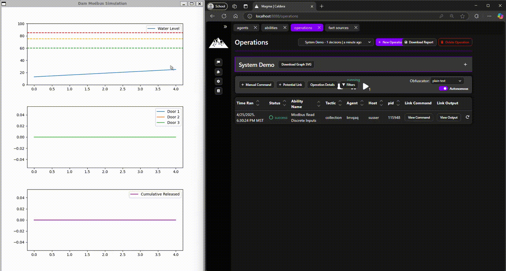

# Simulated Modbus Dam 

The purpose of this system is to start up a process simulation of a Dam that can be manipulated externally using modbus commands.

## Description

The ICS Dam water management system enhances MITRE Caldera for OT by introducing simulated devices that replicate control hardware and industrial process interactions. These devices integrate the Modbus protocol, offering a realistic, accessible, and cost-effective platform for cybersecurity testing and training, empowering users without requiring physical ICS hardware.

## Getting Started

### Dependencies

* Python3 (tested with Python 3.10.12)
* Should work on any OS (Tested on Ubuntu 22.04 LTS)
* Caldera is recommended for testing, installation instructions found [here](https://github.com/mitre/caldera?tab=readme-ov-file)

### Installing
1. Clone the GitHub: [link](https://github.com/mitre/wildcatdam) 
2. cd simulated-process
3. Install dependencies (venv recommended but optional)
``` bash
python3 -m venv venv
source venv/bin/activate
pip install -r requirements.txt
```
4. Start the script:
``` bash
python3 damSystem.py 
```


### Executing program

To start the script:
``` bash
python3 damSystem.py 
```

#### Demo


There are 2 ways of interacting with the system:
1. Using Caldera UI
> Check the [caldera github](https://github.com/mitre/caldera) to learn more about this
2. Sending direct payloads through the Caldera MODBus plugin
> Check [Caldera Modbus](https://github.com/mitre/caldera-ot) plugins to learn more about this

## Help

If issues with simulation arise... 
1. Check config.yaml for variable details
2. Check script terminal for debug information

## Authors

University of Arizona Team

In Collaboration with MITRE Caldera - caldera@mitre.org


## Version History

* 1.0
    * Initial Release

## License

This project is licensed under the Apache-2.0 License - see the LICENSE.md file for details

## Acknowledgments

* [Mitre Caldera](https://github.com/mitre/caldera)
* [Caldera for OT](https://github.com/mitre/caldera-ot)
* [Pymodbus](https://pymodbus.readthedocs.io/en/latest/)