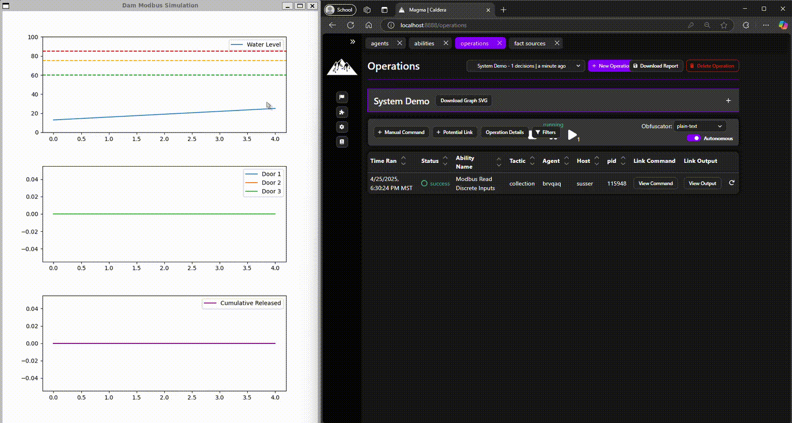

# Wildcat Dam: Modbus Dam Simulator 

A simplified simulation of a dam with Modbus process control. Designed to serve
as a complement to MITRE Caldera for OT.



## Description

Wildcat Dam enhances MITRE Caldera for OT by introducing a simulated device that
replicates control hardware and industrial process interactions. This simulator
integrates with the [Modbus plugin](https://github.com/mitre/modbus) to offering
an accessible and cost-effective platform for cybersecurity testing and
training, empowering users without requiring physical ICS hardware.

## Getting Started

### Dependencies

* Python3 (tested with Python 3.10.12)
* Should work on any OS (tested on Ubuntu 22.04 LTS)
* Caldera with the Modbus plugin to interact with the system (*optional but highly recommended*) 
  * [Caldera installation instructions](https://github.com/mitre/caldera?tab=readme-ov-file#requirements)
  * [Modbus plugin installation instructions](https://github.com/mitre/modbus?tab=readme-ov-file#installation)

### Installation
1. Clone this repo:
```bash
git clone https://github.com/mitre/wildcatdam.git
```
2. Install dependencies (venv recommended but optional)
``` bash
python3 -m venv venv
source venv/bin/activate
pip install -r requirements.txt
```
3. Start the process:
``` bash
python3 damSystem.py 
```

## Usage

Follow the steps below to interact with the Wildcat Dam control system using Caldera and the Modbus plugin:

### Step 1: Start the Process
```bash
python3 damSystem.py 
```
Ensure the simulator is properly set up and running. If the system does not start, ensure the [dependencies](#dependencies) and [requirements](#installation) have been installed.

### Step 2: Start Caldera
```bash
python3 server.py
```
From another terminal, launch the Caldera adversary emulation platform. Make
sure the Modbus plugin is installed and loaded. The Modbus plugin enables
communication with the Wildcat Dam control system using Modbus protocol
commands.

**Tip**: If the Modbus plugin is not already installed, refer to the [plugin documentation](https://github.com/mitre/modbus?tab=readme-ov-file#installation) for instructions on how to install and activate the plugin.

### Step 3: Create a New Operation
From the Caldera web GUI, navigate to the Operations page. Create a new operation to begin interacting with Wildcat Dam.

**Recommended Settings**:  
- Assign a meaningful name to the operation (e.g., "Wildcat Dam Control Test").
- Leave the Fact Source as "basic" (check back soon for a Wildcat Dam fact source).
- Keep all other settings in their defaults.

### Step 4: Execute Modbus Abilities
Use the abilities provided by the Modbus plugin to send commands to the Wildcat Dam control system. These abilities allow you to simulate various control actions, such as opening or closing gates, adjusting gate setpoints, or querying system status.

**How to Execute Abilities:**
- Within your operation, select "Add potential link." In the popup window, search for "modbus" to locate the Modbus plugin abilities.
- Select the desired ability (e.g., "Read Input Registers").
- Fill in the necessary facts to match the values set in `config.yaml`.
- Execute the ability and wait for the command output.
Pro Tip: Review the Modbus plugin documentation for a detailed list of available abilities and their expected behavior. Experiment with different commands to fully explore the capabilities of the Modbus protocol.

### Step 5: Monitor and Analyze
Try running Wireshark while executing abilities to capture the network traffic
sent between Caldera and Wildcat Dam. Test different abilities and different
fact values to investigate how the raw network traffic changes.

## Help

If issues with simulation arise... 
1. Check config.yaml for variable details
2. Check script terminal for debug information

## Authors

University of Arizona INSuRE Team 1

In Collaboration with MITRE Caldera for OT - ot@mitre.org


## Version History

* 1.0
    * Initial Release

## License

This project is licensed under the Apache-2.0 License - see the LICENSE.md file for details

## Acknowledgments

* [MITRE Caldera](https://github.com/mitre/caldera)
* [Caldera for OT](https://github.com/mitre/caldera-ot)
* [Pymodbus](https://pymodbus.readthedocs.io/en/latest/)